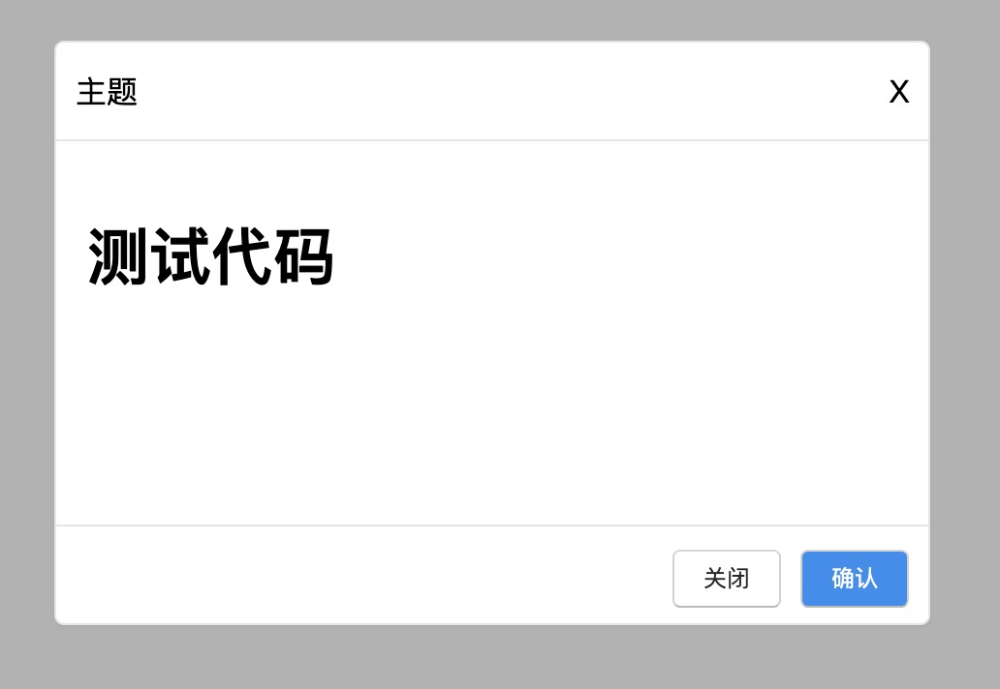

## 使用`@vue/cli`开发一个`typescript`通用组件并发布到`npm`上

## 一、组件分类的介绍

- 1、通用组件

  - 抽象的`UI`组件，无具体的实现
  - 使用需要加入具体的业务代码
  - 具有高通用性和可扩展性

- 2、业务组件

  - 平时我们项目中使用的组件

## 二、`vue`中组件的认识

传统的前端开发中是没组件的概念，自从进入了`vue`、`react`、`angular`的时代，才有了组件的说法，具体我们说的组件说的是什么呢?

就我个人对组件的理解:
我们说的组件可以理解为一个函数或者说的是类，组件中接收的参数可以理解为是函数的参数,类的构造函数。组件中的`this`可以泛指就是类的实例

## 三、初始化空白项目

- 1、[首先要安装`@vue/cli`](https://cli.vuejs.org/zh/guide/installation.html)

* 2、根据官网提供的步骤创建一个`typescript`的项目[链接地址](https://cli.vuejs.org/zh/guide/creating-a-project.html#vue-create)

## 四、设计一个**弹框**组件

- 1、弹框组件主要实现功能
  - 用户调用组件,可以打开、关闭弹框
  * 标题的动态传入
  * 内容体的写入
  * 底部按钮文字及显示按钮
  * 按钮触发事件的回调函数
  * 底部是否可见
  * 底部可以根据用户自定义的渲染
  * 是否可拖动

* 2、组件也要可以全局安装

* 3、主要界面展示
  

## 五、主要代码实现

- 1、[组件的代码实现见](https://github.com/kuangshp/maucash-model)
- 2、配置打包生成`lib`命令

  ```json
  "scripts": {
    "lib": "vue-cli-service build --dest lib --target lib --name maucash-model ./src/packages/index.ts"
  }
  ```

* 3、书写`types`文件

  ```js
  import Vue from 'vue';

  declare function install(vue: typeof Vue): void;

  declare class MaucashModel extends Vue {}

  declare const _default: {
    install: typeof install;
  };

  export { MaucashModel };

  export default _default;
  ```

* 4、在`packages.json`中配置打包后的引入的目录及`typings`

  ```json
  "main": "lib/maucash-model.umd.min.js",
  "typings": "types/index.d.ts",
  ```

* 6、在`packages.json`中配置需要上传到`npm`的目录文件

  ```json
  "files": [
    "lib/**/*",
    "types/*"
  ]
  ```

## 六、参考代码

- [源码地址](https://github.com/kuangshp/maucash-model)

* [`npm`包地址](https://www.npmjs.com/package/maucash-model)
